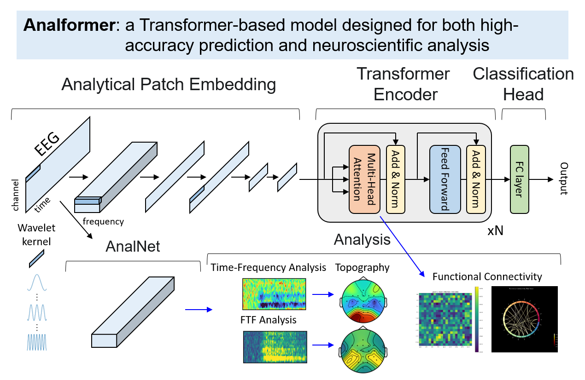
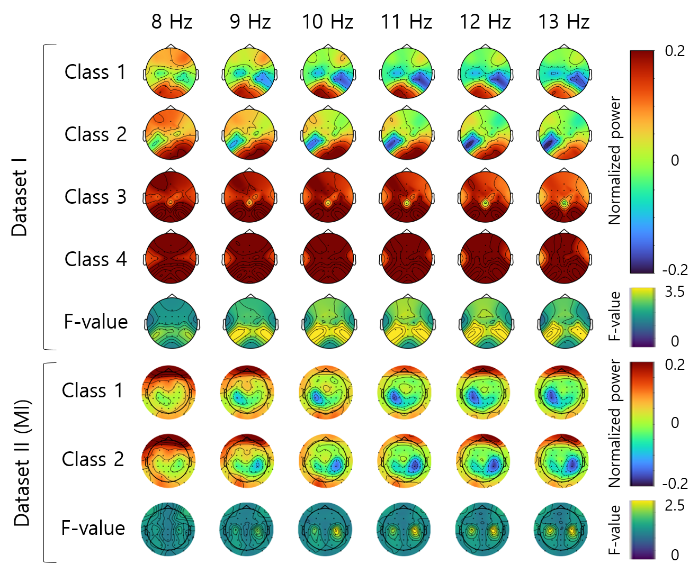
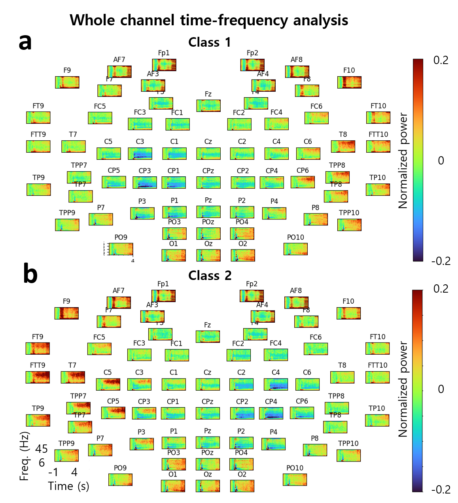
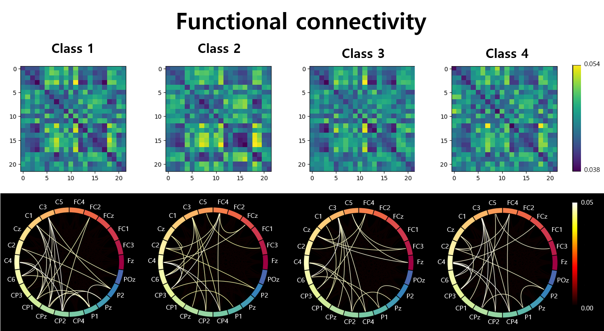

# Analformer: Uma nova arquitetura de transformador para decodificação de EEG e análise neurocientífica

<div align="center">
  <a href="README.md">English</a> |
  <a href="README.de.md">Deutsch</a> |
  <a href="README.es.md">Español</a> |
  <a href="README.fr.md">français</a> |
  <a href="README.ja.md">日本語</a> |
  <a href="README.ko.md">한국어</a> |
  <a href="README.pt.md"><strong>Português</strong></a> |
  <a href="README.ru.md">Русский</a> |
  <a href="README.zh.md">中文</a>
</div>

Este repositório fornece a implementação oficial do artigo Scientific Reports:

**Uma nova arquitetura de transformador para decodificação de EEG e análise neurocientífica**

Hong Gi Yeom, Woo Sung Choi e Kyung-min An, *Relatórios Científicos* (2026).

DOI: [10.1038/s41598-026-56405-9](https://www.nature.com/articles/s41598-026-56405-9)

Analformer é uma arquitetura baseada em Transformer projetada para suportar decodificação de interface cérebro-computador (BCI) de alto desempenho e análise neurocientífica interpretável. O modelo usa núcleos wavelet Morlet fixos e não treináveis ​​em um módulo Analytical Patch Embedding para que representações intermediárias possam ser analisadas com ferramentas familiares de análise de EEG, como mapas de frequência de tempo, topografias, análise de frequência de tempo de valor F (FTF) e conectividade funcional baseada em atenção.

## Visão geral

O Analformer foi avaliado em conjuntos de dados públicos de EEG cobrindo quatro configurações de decodificação:

- **Competição BCI IV 2a**: Imagens Motoras (MI) de quatro classes
- **OpenBMI MI**: imagens motoras de duas classes
- **OpenBMI ERP**: decodificação potencial relacionada a eventos de duas classes
- **OpenBMI SSVEP**: decodificação de potencial evocado visualmente em estado estacionário de quatro classes

A ideia central é preservar a estrutura interpretável do EEG durante a incorporação. Os filtros wavelet Morlet fixos extraem recursos de frequência espaço-temporal, o codificador Transformer aprende as relações entre esses recursos e o cabeçote de classificação prevê a classe BCI alvo. Os resultados da análise são produzidos a partir das representações internas e dos pesos de atenção do modelo.



## Estrutura do Repositório

- `Analformer_BCI_Comp_4_2a.ipynb`: Implementação de imagens motorizadas da competição BCI IV 2a.
- `Analformer_OpenBMI_MI.ipynb`: Implementação de imagens motoras OpenBMI.
- `Analformer_OpenBMI_ERP.ipynb`: Implementação do ERP OpenBMI.
- `Analformer_OpenBMI_SSVEP.ipynb`: Implementação OpenBMI SSVEP.
- `figures/Graphical_abstract.png`: Resumo gráfico do Analformer.
- `figures/Fig4.png`, `figures/Fig5.png`, `figures/Fig7.png`: Exemplos de resultados de análise do artigo.
- `requirements.txt`: Dependências do pacote Python usadas pelos notebooks.

## Requisitos Técnicos

Python 3.9+ é recomendado. Uma instalação PyTorch habilitada para CUDA é recomendada para treinamento.

Instale o PyTorch primeiro de acordo com seu ambiente CUDA. Por exemplo:

```bash
pip3 install torch torchvision torchaudio --index-url https://download.pytorch.org/whl/cu121
```

Em seguida, instale as dependências restantes:

```bash
pip install -r requirements.txt
```

## Preparação de Dados

Os conjuntos de dados não estão incluídos neste repositório. Faça download dos conjuntos de dados públicos de suas fontes originais:

- Competição BCI IV 2a: [http://www.bbci.de/competition/iv](http://www.bbci.de/competition/iv)
- OpenBMI: [https://gigadb.org/dataset/100542](https://gigadb.org/dataset/100542)

Cada notebook espera arquivos `.mat` compatíveis com HDF5 com matrizes `data` e `label`. Os notebooks carregam arquivos de assunto usando o seguinte padrão de nomenclatura:

- Arquivos de treinamento: `A1T.mat`, `A2T.mat`, ...
- Arquivos de avaliação: `A1E.mat`, `A2E.mat`, ...

Defina a pasta do conjunto de dados no dicionário `params` dentro de `main()`:

```python
params = {
    "root": "Enter your dataset folder/",
    ...
}
```

O código assume dados de EEG de 250 Hz. Os notebooks OpenBMI utilizam 62 canais, enquanto o notebook BCI Competition IV 2a utiliza 22 canais.

## Como usar

1. Abra o notebook do conjunto de dados/paradigma que você deseja executar.
2. Atualize `"root"` no dicionário `params` para a pasta do conjunto de dados local.
3. Verifique os principais parâmetros do experimento, como `n_ch`, `n_classes`, `time`, `baseline_sec`, `pretrain_epochs`, `finetuning_epochs`, `depth`, `num_heads` e `att_ch`.
4. Execute as células do notebook em ordem.
5. Use `"anal": 1` para gerar resultados de análise, incluindo mapas de frequência de tempo, topografias, mapas de valores F e visualizações de conectividade baseadas em atenção.

Para notebooks OpenBMI, `Pretraining(params)` é executado antes do ajuste fino específico do assunto. No notebook BCI Competition IV 2a, o fluxo de trabalho atual usa um caminho de ponto de verificação pré-treinado ao pular o pré-treinamento; atualize `pretrained_path` antes de executar esse notebook.

## Exemplos de resultados de análise

As figuras a seguir mostram exemplos representativos de resultados de análises do artigo.

| Figure | Description |
| --- | --- |
|  | Topography analysis during the Motor Imagery (MI) task. |
|  | Whole-channel time-frequency analysis during the Motor Imagery (MI) task for Dataset II. |
|  | Attention-based Functional Connectivity analysis for the four Motor Imagery (MI) tasks in Dataset I. |

## Citação

Se você usar este código, cite:

```bibtex
@article{yeom2026analformer,
  title = {A novel transformer architecture for EEG decoding and neuroscientific analysis},
  author = {Yeom, Hong Gi and Choi, Woo Sung and An, Kyung-min},
  journal = {Scientific Reports},
  year = {2026},
  doi = {10.1038/s41598-026-56405-9}
}
```

## Agradecimentos

Este trabalho foi apoiado pelo fundo de pesquisa da Universidade Chosun.

Partes desta implementação foram desenvolvidas com referência ao repositório [EEG-Conformer](https://github.com/eeyhsong/EEG-Conformer), que é distribuído sob a licença GPL-3.0. Agradecemos aos autores por disponibilizarem publicamente sua implementação.

## Licença

O código-fonte é distribuído sob a licença `LICENSE`. Os números em papel são reproduzidos aqui apenas para explicar a implementação oficial; consulte a [página do artigo](https://www.nature.com/articles/s41598-026-56405-9) para obter detalhes da publicação e informações sobre licenciamento de figuras.
